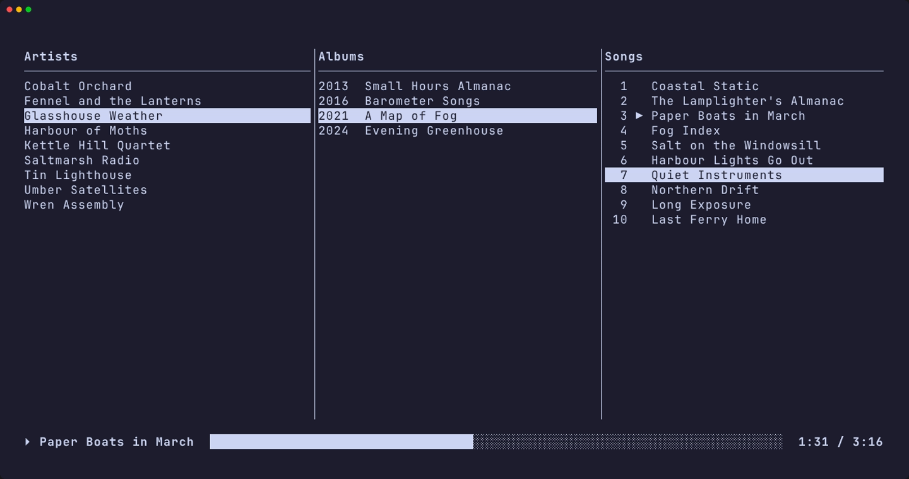
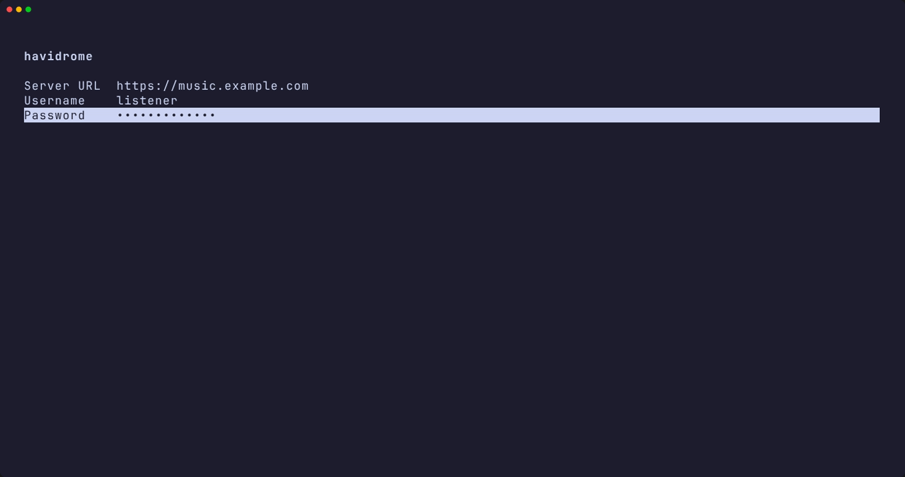
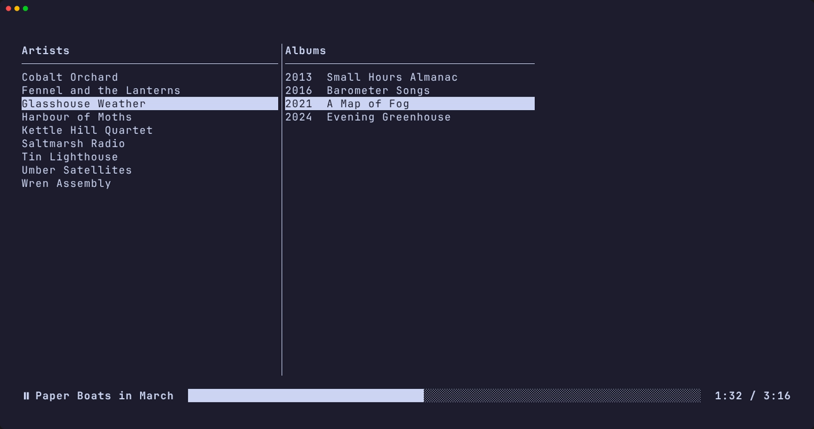

**havidrome** is a terminal music player for your
[Navidrome](https://www.navidrome.org) server. Browse the library artist by
artist, pick a song, and the rest of its album plays after it, in the quality
the server stores it in.



## Features

- Artists, their albums and an album's songs side by side as columns, with the
  picked path highlighted.
- Artists in alphabetical order, albums oldest first, songs in album order.
- Pick any song and its album plays on from there, one song after another.
- Every song streams as the original file on the server — FLAC, Opus, whatever
  it is — never transcoded.
- A strip at the bottom with the song's name, whether it plays or is paused, a
  progress bar, and the elapsed and total time.
- `space` pauses and resumes, `n` and `p` go to the next and previous song, and
  the left and right arrows seek by 5 seconds, or by 30 with shift.
- Browsing stays live while a song plays, and the playing song is marked in its
  album's list.
- Log in once; `l` logs out, to another server or account, and Ctrl+C quits.

## Requirements

- [Nix](https://nixos.org), with flakes enabled.
- A [Navidrome](https://www.navidrome.org) server and an account on it.

## Install

```sh
nix profile add github:purplenoodlesoop/havidrome
```

## Platforms

Linux on x86_64 and aarch64, and macOS on aarch64.

## Screenshots





---

# havidrome

A CLI player for a [Navidrome](https://www.navidrome.org) server, written in
Haskell. It asks for a server on first open, then browses and plays its
library.

Nix owns everything: the compiler, the dependencies, the builds and the tests.
Nothing else needs installing.

## Build and run

```sh
nix build            # ./result/bin/havidrome, a release build
nix run              # build and run it in one step
```

## Debug build

```sh
nix build .#havidrome-debug -o result-debug
```

The debug executable is compiled without optimisation and keeps its DWARF
symbols, so a debugger can follow it; the release one is stripped. `file` tells
them apart:

```
result/bin/havidrome:       ... stripped
result-debug/bin/havidrome: ... with debug_info, not stripped
```

## Configuration

A run with nothing stored opens on a login screen asking for the server URL, a
username and a password: Tab and the up and down arrows move between the three
fields, Enter submits them, and Ctrl+C leaves. Credentials a server accepts are
kept in `$XDG_CONFIG_HOME/havidrome/config` (`~/.config/havidrome/config` when
that variable is unset), one `field=value` line each and the password in the
clear — no keyring, no encryption. The file is the user's own, readable by
nobody else; deleting it discards the credentials.

`l` while browsing logs out: the audio stops, the file goes, and the login
screen comes back for another server or account. Later runs then ask again, as
a first one does.

## Audio

Sound comes from [mpv](https://mpv.io), which the build supplies: the installed
executable carries one on its `PATH`, so nothing has to be installed to play.
It runs with no window, no terminal and none of your own mpv configuration, and
is driven over its JSON IPC.

## Tests

```sh
nix flake check      # builds the package and runs its test suite
```

The tests that drive a real player run it on a null audio output, so they need
no sound device.

## Development

```sh
nix develop          # a shell with GHC and cabal, dependencies already present
cabal build
cabal test
```

With [direnv](https://direnv.net) the shell is entered on `cd` — `direnv allow`
once; `.envrc` is already here.

## Layout

- `src/` — the library, everything the player is made of.
- `app/` — the `havidrome` executable, a thin entry point.
- `test/` — the test suite.
- `nix/havidrome.nix` — the flake's per-system module: packages, checks, shell.

The flake is assembled with [`core-flake`](https://github.com/purplenoodlesoop/core-flake).
